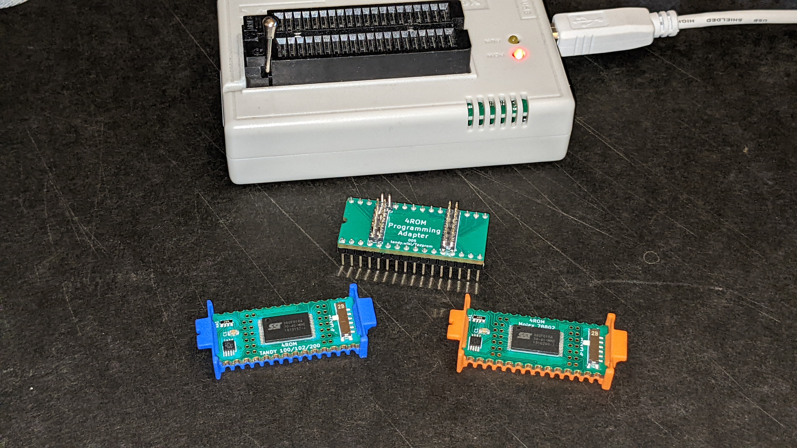
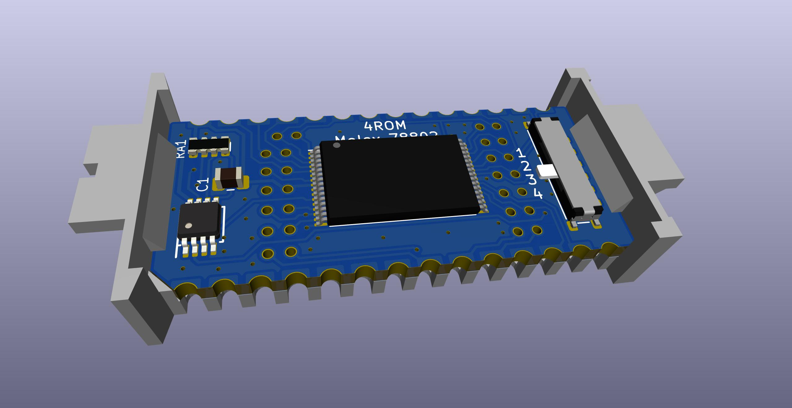
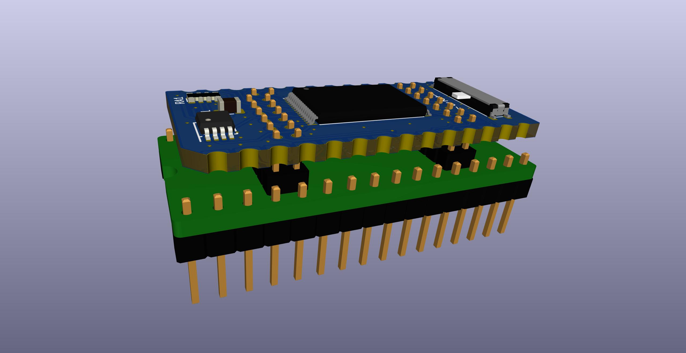
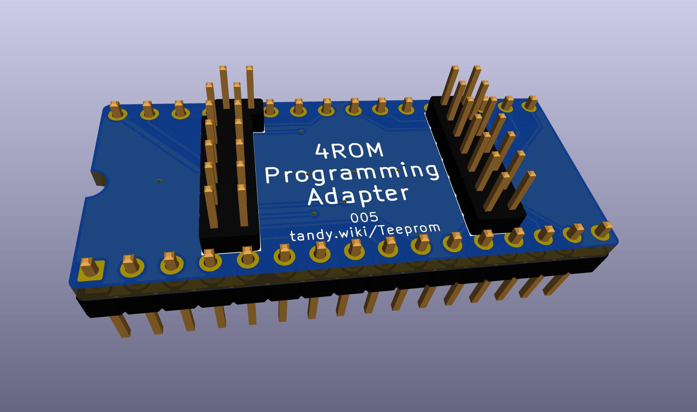

# 4ROM



### 4ROM_100 parts:  
PCB https://www.pcbway.com/project/shareproject/4ROM_100_multi_option_rom_module_for_TRS_80_Model_100_102_200_93cfa6c8.html  
BOM https://www.mouser.com/ProjectManager/ProjectDetail.aspx?AccessID=66e12c3f20 or https://www.digikey.com/short/whn7w258  
Carrier http://shpws.me/SGGB  

### 4ROM_78802 parts:  
PCB https://www.pcbway.com/project/shareproject/4ROM_78802_714ecf32.html  
BOM https://www.mouser.com/ProjectManager/ProjectDetail.aspx?AccessID=66e12c3f20 or https://www.digikey.com/short/whn7w258  
Carrier http://shpws.me/SGGB  

### 4ROM Programming Adapter parts:  
PCB https://www.pcbway.com/project/shareproject/4ROM_Programming_Adapter_fc156337.html  
BOM https://www.mouser.com/ProjectManager/ProjectDetail.aspx?AccessID=a770931c82 or https://www.digikey.com/short/f3jhw9v1


This is a version of Teeprom and Meeprom that uses a 128K 29F010 flash instead of a 32K 28C256 eeprom.

When ordering the PCB:  
Select ENIG copper finish so the castellated edge contacts and programming adapter contacts are gold plated.  
Change the min tacks/spaces option to 6/6mils. The PCBWAY web site automatically selects 5/5 for this board for some reason, but there are no such thin traces or spaces.

The advantages over the original Teeprom are:  
* The flash chip is cheaper and more readily available. The 32K eeprom are now about $10 each and there is only one brand still being made. 128K flash is $1, and there are multiple brands and versions still in production.  
* The programming adapter is cheaper to buy and simpler to use than the soic test clip and wires needed for Teeprom.
* Holds four 32K rom images instead of one.  

The disadvantages are:  
* The board has more parts and is more difficult to solder.

There are 2 versions so far,  
'''4ROM_100''' is only for TANDY 100, 102, & 200, same as Teeprom.

'''4ROM_78802''' is for everything else, Same as Meeprom. Some examples: TANDY 600, Epson PX-4 & PX-8, general industrial applications, most anywhere the Molex 78805 socket is found.

The parts other than the PCB are the same for both 100 and 78802 versions.  
The difference is only in the pinout of the edge connectors. TANDY 100, 102, & 200 have a non-standard pinout. The 78802 version provides a standard 27C256 pinout.  

The same programming adapter is used for both 100 and 78802.








## To write to the chip:  
* Put the 4ROM programming adapter into a programmer.  
* Remove the 4ROM PCB from the carrier and connect it to the programming adapter by the center pins. You don't need to push the pcb all the way down. Just get the pins into the holes at all and that is good. It should be stiff.  
* Select the desired bank number with the slide switch on the 4ROM.  
* Tell the programmer to use device "SST39SF010A", ignore size mismatch, not to automatically erase the whole chip before writing.  
* Write a single 32K rom image.

The following is using a TL-866II+ programmer and the open source [minipro](https://gitlab.com/DavidGriffith/minipro) software.  
(If buying a new programmer, be aware minipro does not support the new T48 or T56 programmers, only TL-866II+ and older.)

### Test the pin connections  
Just to verify that the board is soldered correctly and all of the programming adapter pins are making a good connection.  
It should say pins 2 and 3 are bad, and nothing else.  
```
$ minipro -p 'SST39SF010A' -z
Found TL866II+ 04.2.132 (0x284)
Bad contact on pin:2
Bad contact on pin:3
$
```

The missing pins are the two highest address bits A15 and A16, which exist on the chip but are only connected to bank-select logic on the 4ROM board, not to the programmer pins.

(Note: if using the "minipro" program as shown here, there is currently a [bug](https://gitlab.com/DavidGriffith/minipro/-/issues/283) in the pin test routine where this will say pins 1 & 2 instead of 2 & 3.  
A [fix](https://gitlab.com/DavidGriffith/minipro/-/merge_requests/220) has already been submitted but not merged yet.  
So if you see bad contact on pins 1 & 2 instead of 2 & 3, this is probably normal and you probably just have a version of minipro that isn't fixed yet.  
For the Windows app or any other programmer you only want to see pins 2 & 3 with missing connection)

### Erase the whole chip
Normally the programmer would automatically erase the whole chip before each write, but in this case we don't want that because we want to be able to write one 32K bank without erasing the other 3 banks. But we do still want to erase the whole chip one time before the individual bank writes. So do it here as a seperate operation.
```
$ minipro -p 'SST39SF010A' -u -E
Found TL866II+ 04.2.132 (0x284)
Chip ID: 0xBFB5  OK
Erasing... 0.40Sec OK
$
```

### Write one bank  
Select position "1" on the slide switch, and write one 32K rom image.  
The command line flags here say:  
**-e** do not erase the chip before writing  
**-u** un-protect the chip before writing  
**-P** protect the chip after writing  
**-s** non-fatal warning for the size mis-match from writing only 32K when 128K is expected  
```
$ minipro -p 'SST39SF010A' -u -P -s -e -w MULTIPLAN.rom
Found TL866II+ 04.2.132 (0x284)
Chip ID: 0xBFB5  OK
Warning: Incorrect file size: 32768 (needed 131072)
Writing Code...  1.65Sec  OK
Reading Code...  0.25Sec  OK
Verification OK
$
```

### Write another bank  
Select position "2" on the slide switch, and repeat to write another rom.  
```
$ minipro -p 'SST39SF010A' -u -P -s -e -w BASIC.rom
Found TL866II+ 04.2.132 (0x284)
Chip ID: 0xBFB5  OK
Warning: Incorrect file size: 32768 (needed 131072)
Writing Code...  1.64Sec  OK
Reading Code...  0.25Sec  OK
Verification OK
$
```

