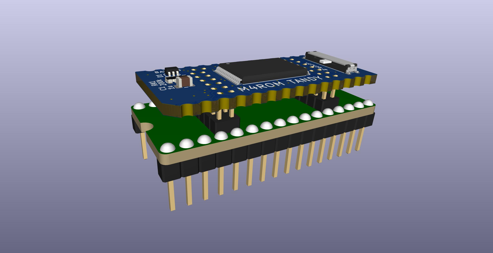
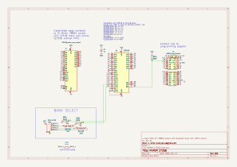
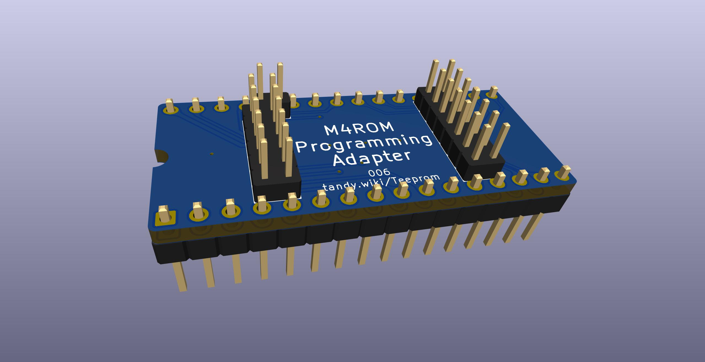

# M4ROM

Virtual 27C256 rom x 4 to fit Molex 78805 socket


This is a version of [Teeprom and Meeprom](https://github.com/bkw777/Teeprom) that uses a 128k 29F010 flash instead of a 32k 28C256 eeprom.

The advantages over the original Teeprom are:  
* The flash chip is cheaper and more readily available than the eeprom.  
* The programming adapter is cheaper to buy and simpler to use than the soic test clip.
* Holds four 32k rom images instead of one.  

The disadvantages are:  
* The board has more parts and is more difficult to solder.

There are two almost identical versions supporting two commonly needed pinouts:  
'''M4ROM_TANDY''' is only for TANDY 100, 102, & 200, same as Teeprom.  
'''M4ROM_27256''' is for everything else, same as Meeprom. (TANDY 600, Epson PX-4 & PX-8, Kyotronic KC-85)

All parts other than the PCB are the same for both versions.  
The difference is only in the pinout of the castellated edge connectors. TANDY 100, 102, & 200 have a non-standard pinout. The 27256 version provides a standard 27C256 or 32Kx8 parallel mask rom pinout.

The same programming adapter is used for both.


<!--  -->






### Parts
[TANDY PCB @ PCBWAY](https://www.pcbway.com/project/shareproject/4ROM_100_multi_option_rom_module_for_TRS_80_Model_100_102_200_93cfa6c8.html)

[27256 PCB @ PCBWAY](https://www.pcbway.com/project/shareproject/4ROM_78802_714ecf32.html)

[Carrier @ PCBWAY](https://www.pcbway.com/project/shareproject/Molex_7880x_28_PCB_Carrier_9419cd9c.html)

[BOM @ DigiKey](https://www.digikey.com/short/z1j1wwrj)

[Programming Adapter PCB @ PCBWAY](https://www.pcbway.com/project/shareproject/4ROM_Programming_Adapter_fc156337.html)

[Programming Adapter BOM @ DigiKey](https://www.digikey.com/short/drp9qj7w)

When ordering the PCB:  
* Min Tracks/Spaces: 6mil  
  The order page sometimes auto-selects 5mil which is more expensive, but there are no such thin traces or spaces.  
* Copper Finish: ENIG    (not the programming adapter)  
  So the castellated edge contacts and programming adapter contacts are gold plated.

# Programming the chip  
First a few notes,  
Do a full chip erase once first, seperately from writing the banks.  
Disable the usual default automatic erase-first when writing.  
Each bank can only be written once per erase. To over-write a bank, you have to erase the whole chip and write all 4 banks again.  

Procedure:  
1 Put the programming adapter into a programmer.  
2 Remove the M4ROM PCB from the carrier and connect it to the programming adapter by the center pins. DON'T try to push the PCB all the way down. It should be stiff right away while the board is still near the top of the pins.  
3 [Test pin connections](#test-the-pin-connections). Pin-test function in the programmer, it should say bad contact on pins 2 & 3, and nothing else.  
4 [Erase the whole chip](#erase-the-whole-chip).  
5 Select the desired bank number with the slide switch on the M4ROM.  
6 [Write a single 32K rom image](#write-one-bank). Disable erase-first.  
7 Repeat 5 & 6 for the remaining banks.

The chip may be re-written as many times as you want, but once data has been written to a given bank, that bank can not be written again without erasing the whole chip again first.  

## Example
The following is using a TL-866II+ programmer and the open source [minipro](https://gitlab.com/DavidGriffith/minipro) software.  

### Test the pin connections  
It should say bad contact on pins 2 and 3, and nothing else.  
```
$ minipro --device 'SST39SF010A' --pin_check
Found TL866II+ 04.2.132 (0x284)
Bad contact on pin:2
Bad contact on pin:3
$
```

If you see anything else, try pushing the PCB down slightly harder. It still shouldn't go anywhere near all the way down, and don't try to force it, but the harder you push down the harder the pins wedge in the holes.

The way the programming adapter connection works is the holes are almost the exact size of the pins, and the holes are spaced closer together than the pins, so the pins bind up tighter the further down you push the PCB. As the PCB slides down, the pins are pushed sideways and lean over, and make contact at both the bottom and top edges of the PCB.

### Read one bank
The actual chip is a 128K part like 39SF010, but we can't read 128K we can only read 32K because not all of the address lines are connected from the chip to the programmer.  
The most convenient way to make the programmer read less than 128K is to tell the programmer to read a 32K chip that has the same kind of read cycle as the actual chip, like AM28F256.

```
$ minipro --device 'AM28F256' --skip_id --read bank1.bin
Found TL866II+ 04.2.132 (0x284)
Device code: 19339229
Serial code: XYG0VZ54DQ4VCC53WFWZ
USB speed: 12Mbps (USB 1.1)
WARNING: skipping Chip ID test
Reading Code...  0.30Sec  OK
$ 
```

### Erase the whole chip
The chip must be erased once before writing any banks, and then the normal erase-before-write must be suppressed when writing the individual banks.

Once the whole chip is erased, each bank may be written once.

It's not possible to erase a single bank, only the whole chip, so in order to re-write a bank that isn't currently blank, the whole chip must be erased again.

```
$ minipro --device 'SST39SF010A' --unprotect --erase
Found TL866II+ 04.2.132 (0x284)
Chip ID: 0xBFB5  OK
Erasing... 0.40Sec OK
$
```

### Write one bank  
For writing unlike reading we have to tell the programmer the correct actual device instead of some 32K device, but unlike for reading we do have an option to write less than 128K.  
Disable the automatic erase-before-write.  
Enable the software write-protection after writing. This protects against corruption during power-down & power-up transitions.  
The rom image file should be 32K bytes.

```
$ minipro --device 'SST39SF010A' --unprotect --protect --no_size_error --skip_erase --write TSD101.BX
Found TL866II+ 04.2.132 (0x284)
Device code: 19339229
Serial code: XYG0VZ54DQ4VCC53WFWZ
Chip ID: 0xBFB5  OK
Warning: Incorrect file size: 32768 (needed 131072)
Writing Code...  1.75Sec  OK
Reading Code...  0.25Sec  OK
Verification OK
```

# References
[Molex78802_Module](https://github.com/bkw777/Molex78802_Module)  
