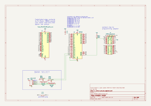
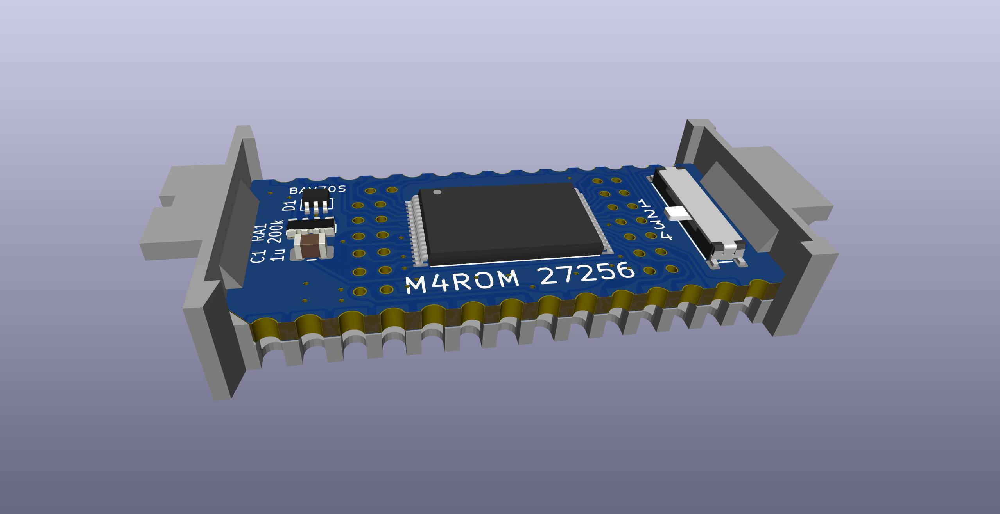
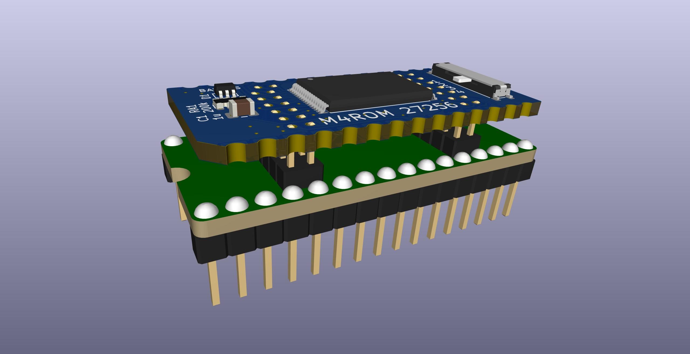

# M4ROM

Virtual 27C256 rom x 4 to fit Molex 78805 socket


This is a version of [Teeprom and Meeprom](https://github.com/bkw777/Teeprom) that uses a 128k 29F010 flash instead of a 32k 28C256 eeprom.

The advantages over the original Teeprom are:  
* The flash chip is cheaper and more readily available than the eeprom.  
* The programming adapter is cheaper to buy and simpler to use than the soic test clip.
* Holds four 32k rom images instead of one.  

The disadvantages are:  
* The board has more parts and is more difficult to solder.

There are two almost identical versions supporting two commonly needed pinouts:  
'''M4ROM_TANDY''' is only for TANDY 100, 102, & 200, same as Teeprom.  
'''M4ROM_27256''' is for everything else, same as Meeprom. (TANDY 600, Epson PX-4 & PX-8, Kyotronic KC-85)

All parts other than the PCB are the same for both versions.  
The difference is only in the pinout of the edge connectors. TANDY 100, 102, & 200 have a non-standard pinout. The 27256 version provides a standard 27C256 or 32Kx8 parallel mask rom pinout.

The same programming adapter is used for both.



<!--  -->







### Parts
  
  As of March 2025 Microchip has changed the flash chip part number from SST39SF010A-xx-xx-WHE to SST39SF010A-xx-xx-TU.  
  The old parts are no longer available, and the new parts are not yet available in individual quantities, but are "available to order".  
  The BOM below is not updated yet and still has the WHE part number.  
  But even with the new part number you may not be able to buy one.  
  You will have to get it from ebay or other sources of old stock.  
  Also search for the Greenliant version GLS29EE010-xx-xx-WHE, or any 5V 29F010 with a 14mm sTSOP-32 package.

[TANDY-compatible PCB @ PCBWAY](https://www.pcbway.com/project/shareproject/4ROM_100_multi_option_rom_module_for_TRS_80_Model_100_102_200_93cfa6c8.html)

[27256-compatible PCB @ PCBWAY](https://www.pcbway.com/project/shareproject/4ROM_78802_714ecf32.html)

[BOM @ DigiKey](https://www.digikey.com/short/7f784j27)

[Carrier @ Shapeways](http://shpws.me/SGGB)

When ordering the PCB (only for the M4ROM, not the programming adapter):  
Select ENIG copper finish so the castellated edge contacts and programming adapter contacts are gold plated.  
Change the min tacks/spaces option to 6/6mils. The PCBWAY web site automatically selects 5/5 for this board for some reason, but there are no such thin traces or spaces.

### Programming Adapter  
[Programming Adapter PCB @ PCBWAY](https://www.pcbway.com/project/shareproject/4ROM_Programming_Adapter_fc156337.html)  
[Programming Adapter BOM @ DigiKey](https://www.digikey.com/short/f3jhw9v1)


# Programming the chip  
* Put the programming adapter into a programmer.  
* Remove the M4ROM PCB from the carrier and connect it to the programming adapter by the center pins. You don't need to push the pcb all the way down. Just get the pins into the holes at all and that is good. It should be stiff.  
* Select the desired bank number with the slide switch on the M4ROM.
* Configure the programmer:  
  * device "SST39SF010A"  
  * ignore size mismatch  
* Write a single 32K rom image.
* After writing the first bank, for the remaining banks, also add:
  * do not automatically erase the whole chip before writing

The chip may be re-written as many times as you want, but once data has been written to a given bank, that bank can not be written again without erasing the whole chip again first.  

## Example
The following is using a TL-866II+ programmer and the open source [minipro](https://gitlab.com/DavidGriffith/minipro) software.  

### Test the pin connections  
It should say bad contact on pins 2 and 3, and nothing else.  
```
$ minipro --device 'SST39SF010A' --pin_check
Found TL866II+ 04.2.132 (0x284)
Bad contact on pin:2
Bad contact on pin:3
$
```

If you see anything else, inspect the pin connections and solder work.

You may try pushing the pcb further down onto the programming adapter to make the pins bind up a little tighter and contact better, but DON'T try to push the board all the way down.

The holes in the M4ROM are spaced closer together than the pins on the programming adapter, so the pins bind up tighter the further down you push the M4ROM.

It should be essentially impossible to push it all the way down, and so **don't try**, but the further you go the stronger the pins contact.

### Erase the whole chip
The chip must be erased once before writing any banks, and then the normal erase-before-write must be suppressed when writing the individual banks.

The whole chip must also be erased in order to over-write any bank that isn't currently blank.  
Data can not be over-written without first erasing, and there is no way to erase just one bank without erasing the whole chip, so in order to over-write a bank that isn't already blank, the whole chip must be erased again and all banks must be re-written.

```
$ minipro --device 'SST39SF010A' --unprotect --erase
Found TL866II+ 04.2.132 (0x284)
Chip ID: 0xBFB5  OK
Erasing... 0.40Sec OK
$
```

Alternatively, you may skip this step and just omit `-e` or `--skip_erase` while writing the first bank, and then add it for all remaining banks.

### Write one bank  
Select position `1` on the slide switch, and write one 32K rom image.  
```
$ minipro --device 'SST39SF010A' --unprotect --protect --no_size_error --skip_erase --write TSD101.BX
Found TL866II+ 04.2.132 (0x284)
Device code: 19339229
Serial code: XYG0VZ54DQ4VCC53WFWZ
Chip ID: 0xBFB5  OK
Warning: Incorrect file size: 32768 (needed 131072)
Writing Code...  1.75Sec  OK
Reading Code...  0.25Sec  OK
Verification OK
```

### Write another bank  
Select position `2` on the slide switch, and repeat to write another rom.  
(this shows the short versions of all the same commandline flags as above)  
```
$ minipro -uPes -p 'SST39SF010A' -w UR2100.BX
Found TL866II+ 04.2.132 (0x284)
Device code: 19339229
Serial code: XYG0VZ54DQ4VCC53WFWZ
Chip ID: 0xBFB5  OK
Warning: Incorrect file size: 32768 (needed 131072)
Writing Code...  1.75Sec  OK
Reading Code...  0.25Sec  OK
Verification OK
```


# References
[Molex78802_Module](https://github.com/bkw777/Molex78802_Module)  
